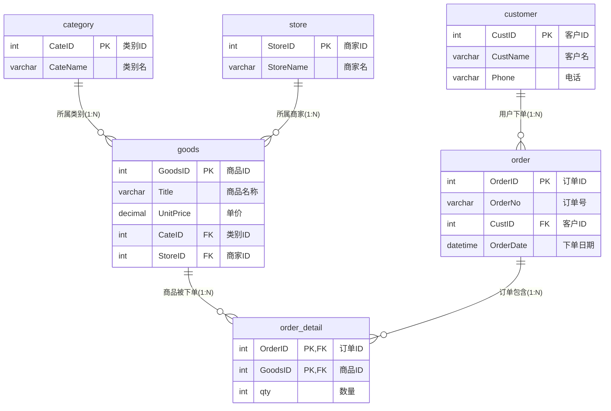

```mermaid
erDiagram
    category ||--o{ goods : "所属类别(1:N)"
    store ||--o{ goods : "所属商家(1:N)"
    goods ||--o{ order_detail : "商品被下单(1:N)"
    customer ||--o{ order : "用户下单(1:N)"
    order ||--o{ order_detail : "订单包含(1:N)"
    
    category {
        int CateID PK "类别ID"
        varchar CateName "类别名"
    }
    
    store {
        int StoreID PK "商家ID"
        varchar StoreName "商家名"
    }
    
    goods {
        int GoodsID PK "商品ID"
        varchar Title "商品名称"
        decimal UnitPrice "单价"
        int CateID FK "类别ID"
        int StoreID FK "商家ID"
    }
    
    customer {
        int CustID PK "客户ID"
        varchar CustName "客户名"
        varchar Phone "电话"
    }
    
    order {
        int OrderID PK "订单ID"
        varchar OrderNo "订单号"
        int CustID FK "客户ID"
        datetime OrderDate "下单日期"
    }
    
    order_detail {
        int OrderID PK,FK "订单ID"
        int GoodsID PK,FK "商品ID"
        int qty "数量"
    }
  
```